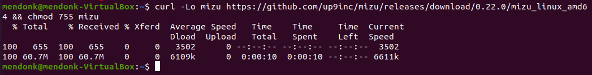

# Mizu

**Mizu** is a simple but powerful API traffic viewer for Kubernetes that helps you troubleshoot and debug your microservices. Think TCPDump and Chrome Dev Tools combined.

To install **Mizu**, download the release that matches your platform as below. 

**Mac** (Intel)

<syntaxhighlighter>curl -Lo mizu github.com/up9inc/mizu/releases/download/0.22.0/mizu_darwin_amd64 && chmod 755 mizu </syntaxhighlighter>

**Mac** (Apple M1 silicon)

<syntaxhighlighter>curl -Lo mizu github.com/up9inc/mizu/releases/download/0.22.0/mizu_darwin_arm64 && chmod 755 mizu</syntaxhighlighter>

**Linux** 

<syntaxhighlighter>curl -Lo mizu github.com/up9inc/mizu/releases/download/0.22.0/mizu_linux_amd64 && chmod 755 mizu</syntaxhighlighter>

**Windows** (Intel 64bit)

<syntaxhighlighter>curl -LO github.com/up9inc/mizu/releases/download/0.22.0/mizu.exe</syntaxhighlighter>

Your installation will look something like this:

You've successfully installed **Mizu**. To start tapping pods, continue to the [Mizu CLI](/2_mizu_CLI.md).

## Learn More

Learn more about Mizu at [GetMizu.io](http://getmizu.io/) or join our community Slack at [up9.slack.com](https://join.slack.com/t/up9/shared_invite/zt-tfjnduli-QzlR8VV4Z1w3YnPIAJfhlQ).
