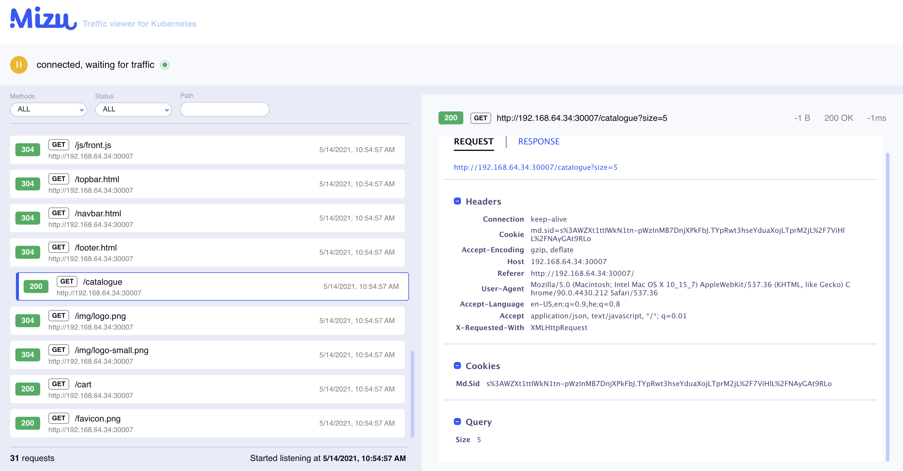

# Mizu UI

The Mizu UI is found after tapping your pods and visiting the `https://localhost:8899` link that Mizu provides. Here, you can view live traffic between pods and see requests, responses, errors, bodies, and headers.

Filter traffic by service, method, status, source, and processing state to proactively troubleshoot.

## Learn More

Learn more about Mizu at [GetMizu.io](http://getmizu.io/) or join our community Slack at [up9.slack.com](https://join.slack.com/t/up9/shared_invite/zt-tfjnduli-QzlR8VV4Z1w3YnPIAJfhlQ).
