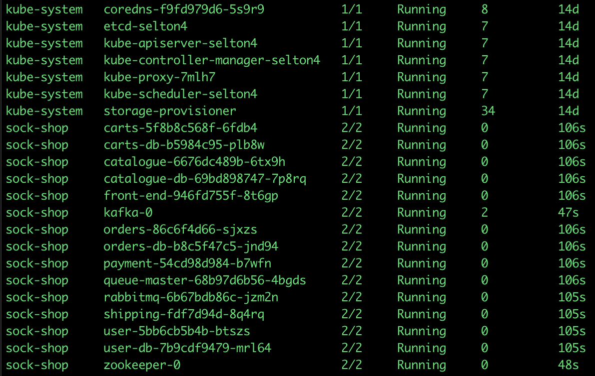
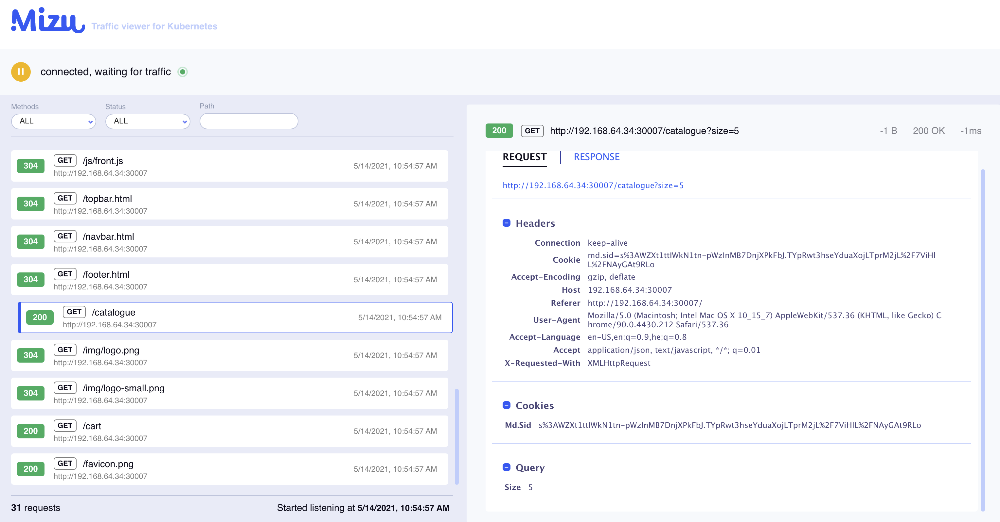

# Tapping Pods

At the core of **Mizu** functionality is the pod tap. **Mizu** displays all API communication in your microservices deployment with just one command.

## Example

Assume this is a list of our running pods:

To display traffic on the `catalogue-b87b45784-sxc8q` pod:

<syntaxhighlighter>mizu tap catalogue-b87b45784-sxc8q</syntaxhighlighter>

To view traffic of several pods, identified by a regular expression:

<syntaxhighlighter>mizu tap "(catalo*|front-end*)"</syntaxhighlighter>

The above command will observe the traffic of the following pods as their names match the regular expression `"(catalo*|front-end*)"`:

- **catalo**gue-6676dc489b-6tx9h
- **catalo**gue-db-69bd898747-7p8rq
- **catalo**ront-end-946fd755f-8t6gp

After tapping your pods, Mizu will tell you that "Web interface is now available at `https://localhost:8899/`. Visit the link from Mizu to view traffic in the Mizu UI.

Here, Mizu is waiting for traffic to be generated. Generate traffic in your pods and observe as Mizu observes traffic in real time.

## Learn More

Learn more about Mizu at [GetMizu.io](http://getmizu.io/) or join our community Slack at [up9.slack.com](https://join.slack.com/t/up9/shared_invite/zt-tfjnduli-QzlR8VV4Z1w3YnPIAJfhlQ).
