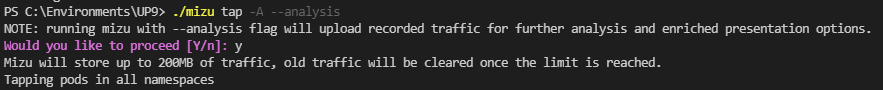

# Analysis in Mizu

**Mizu** is fundamentally a traffic viewer, but by passing the traffic to UP9 for analysis, we can export Swagger, Postman, and Open API test collections. This guide will show you how!

Note: The `--analysis` function is still in beta testing.

## Analysis

When you tap your pods with **Mizu**, adding the `--analysis` flag passes your traffic data to UP9 for analysis. You don't need an UP9 membership to use the traffic viewer.

To tap all of your pods with **Mizu** and send the analysis to **UP9**:

<syntaxhighlighter>mizu tap -A --analysis</syntaxhighlighter>

The response will look like this:

Note: The above message is still under review.

In the **Mizu** UI at `https://localhost:8899/`, after about a minute, an **ANALYSIS** button will appear in the upper-right corner. This button will open the **UP9** UI.

## Export Spec from UP9

In the **UP9** UI, select the **EXPORT SPEC** button in the **Contracts** tab to download a ZIP of tests, mocks, and contracts built from the observed **Mizu** traffic.

The `contracts` folder contains Open API spec (Swagger) JSON files.

The `tests` folder contains both regular and simple Postman tests.

To use the Postman tests, open Postman, click "Import" and select `UP9.postman_collection.json` from your file system.

## Learn More

Learn more about Mizu at [GetMizu.io](http://getmizu.io/) or join our community Slack at [up9.slack.com](https://join.slack.com/t/up9/shared_invite/zt-tfjnduli-QzlR8VV4Z1w3YnPIAJfhlQ).
