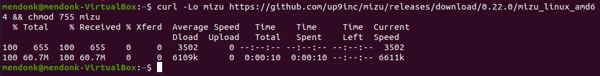

# Mizu Release Notes

## Mizu Version 0.22.0

### What's New

1. Mizu Installation 

    * Has the same Mizu functionality, but with persistence and password protection. 
    * To use, download Mizu release 0.22.0 and execute `mizu install`. 

2. Mizu View

    * Opens the browser to the Mizu login page after `mizu install`. 

Set up an admin password, select which pods you want to tap, and you will arrive at the Mizu UI. 

### Bug Fixes

* Mizu now works with HTTPS URLs
* Mizu now taps Kafka message payloads

## Mizu Version 0.21.0

### What's New

1. New traffic search & stream experience 

    * Rich query language with full-text search capabilities on headers & body
    * Distinct live-streaming vs paging/browsing modes, all with filters applied

2. Display improvements - display source and destination IP address & service names for traffic items

3. Mizu health - Display warning when not all requested pods are up and running properly. Pod tapping status is reflected in the pod's list in the top bar

### Bug Fixes

* Fixed HTTP2 upgraded requests not being displayed
* Fixed displaying of several duplicate HTTP entries
* Now displays a more user-friendly message when tapper fails to deploy because of pod security policy

## Learn More

Learn more about Mizu at [GetMizu.io](http://getmizu.io/) or join our community Slack at [up9.slack.com](https://join.slack.com/t/up9/shared_invite/zt-tfjnduli-QzlR8VV4Z1w3YnPIAJfhlQ).