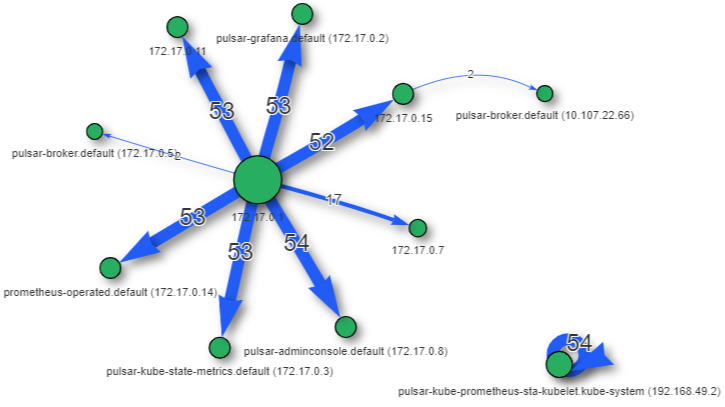

# Mizu Service Map

**Mizu** offers a **Service Map** to display your Kubernetes cluster. It is controlled by the `service map` and `telemetry` values in the `config.yaml` file.

**Mizu** behavior can be modified via the YAML configuration file located at `$HOME/.mizu/config.yaml`. 

Default values for the file can be viewed via the `mizu config` command.

## Enable Service Map

To enable the **Service Map** functionality, we first generate a new `config.yaml` file for Mizu:

<syntaxhighlighter>mizu config -r</syntaxhighlighter>

The command will return: `Template file written to $HOME/.mizu/config.yaml`.

### Modify Config File

`Config.yaml` needs two changes to enable service map:

1. Change `telemetry:true` to `telemetry:false`. This prevents Mizu from collecting anonymous telemetry from the tap. 
2. Add `service-map:true` to the values in `config.yaml`. Mizu will instead rout the collected telemetry to create the service map. 

The last five lines of your `config.yaml` will look like this:

```yaml
telemetry: false
dump-logs: false
kube-config-path: ""
headless: false
service-map: true
```

Save the `config.yaml` file and return to your terminal. 

### Tap with Service Map

Run `mizu tap -A` to tap all pods in all namespaces. You don't have to tap all pods, but we are using it for this example. **Mizu** will open the UI at `http://localhost:8899`. You will see the usual **Mizu** page, but with a **Service Map** button in the upper right hand corner. Select this button to use the **Service Map**. 

## Service Map

The **Service Map** displays your current pods and the relationships between them. Select **Reset** to clear tapping information and rebuild the map from new tapping input, or **Refresh** to pull existing pod data again. 




