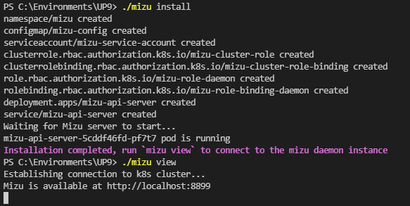

# Installing Mizu for Enterprise

Installing Mizu for Enterprise is a quick and painless process. We provide downloads over TLS along with SHA256 sums to verify the binaries. This installation includes password protection, long-term Mizu functionality, and persistent storage. 

If you'd like to install Mizu with a Helm chart, see [Helm Chart Installation](/mizu_helm_install.md).

## Download Mizu for Enterprise

Download the release that matches your platform as below. 

**Mac** (Intel)

<syntaxhighlighter>curl -Lo mizu github.com/up9inc/mizu/releases/download/0.22.0/mizu_darwin_amd64 && chmod 755 mizu </syntaxhighlighter>

**Mac** (Apple M1 silicon)

<syntaxhighlighter>curl -Lo mizu github.com/up9inc/mizu/releases/download/0.22.0/mizu_darwin_arm64 && chmod 755 mizu</syntaxhighlighter>

**Linux** 

<syntaxhighlighter>curl -Lo mizu github.com/up9inc/mizu/releases/download/0.22.0/mizu_linux_amd64 && chmod 755 mizu</syntaxhighlighter>

**Windows** (Intel 64bit)

<syntaxhighlighter>curl -LO github.com/up9inc/mizu/releases/download/0.22.0/mizu.exe</syntaxhighlighter>

### Checksums

SHA256 checksums are available for compiled binaries. To verify, run:
<syntaxhighlighter>shasum -a 256 -c mizu_OS_ARCH.sha256</syntaxhighlighter>

## Install Mizu for Enterprise

Once the download is complete, run `mizu install` to install **Mizu for Enterprise**. 

When the installation is complete, the **Mizu** daemon will run indefinitely in your cluster until you run `mizu clean`. 

Access **Mizu** with `mizu view` or `kubectl -n mizu port-forward svc/mizu-api-server`. Your installation should look like this:

Running `mizu view` will open the Mizu UI at `http://localhost:8899`. Enter your password, and select the pods you want to tap. 

The Mizu Enterprise UI will appear with your traffic streaming. **Mizu for Enterprise** is now installed. 

## Uninstall Mizu

To uninstall **Mizu**, run `mizu clean`.

