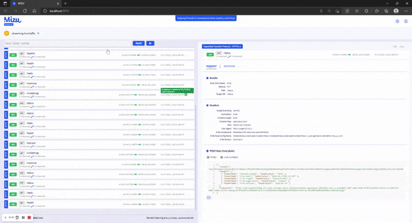

# Mizu UI

The Mizu UI displays traffic between pods. View requests, responses, errors, bodies, and headers. Filter traffic by service, method, status, source, and processing state to proactively troubleshoot.

## Mizu Login

After installing Mizu, use `mizu view` to open the Mizu UI at `localhost:8899`. Here you can control users and environments, which namespaces you're tapping, and 

## Analysis

When you tap your pods with Mizu, adding the `--analysis` flag will pass your traffic data to storage for analysis. 

Mizu will tell you your `According to your request, we are sending your traffic for analysis. Press `^C` to exit this process.`

In the Mizu UI at `https://localhost:8899/`, after about a minute, an ANALYSIS button will appear in the upper-right corner. This button will open the analysis UI.

## Filtering

Mizu has a rich filtering syntax that let's you query the results both flexibly and efficiently. 

The filter window offers some other regex examples to try out to query your results. 
